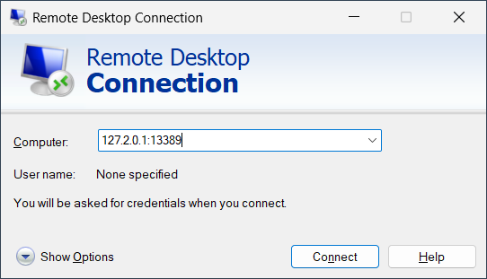

# Azure Relay Bridge - Windows Remote Desktop (RDP) example

This directory contains a set of sample files illustrating how to bridge the
Windows Remote Desktop client to a remote Windows instance in a private network
via Azure Relay.

```
  Private Network A          │          │ Private Network B - on "mypc"
                             │          │
                             │          │
                             │          │
         TCP:127.1.0.2:13389 │          │             TCP:localhost:3389
┌──────────┐      ┌────────┐ │          │   ┌────────┐    ┌─────────────┐
│          │      │        │ │          │   │        │    │             │
│  Client  ├──────►azbridge├─┼──────┐ ┌─┼───►azbridge├────► Windows RDP │
│          │      │        │ │      │ │ │   │        │    │             │
└──────────┘      └────────┘        │ │     └────────┘    └─────────────┘
                                 ┌──▼─┴───┐
                                 │  mypc  │
                                 │        │
azbridge -f ./client_config.yml  │        │ azbridge -f ./server_config.yml
                                 └────────┘
                                 Azure Relay
                                  Namespace
```

## Relay Setup

First, create an Azure Relay namespace with a Hybrid Connection named for the
target machine name. 

The included [Azure
Powershell](https://learn.microsoft.com/en-us/powershell/azure/) script
`Deploy-Relay.ps1` can be called with the name of the namespace and the Azure
region and the machine name, for instance, and deploys the included resource
template:

```Powershell
$result=./Deploy-Relay.ps1 mynamespacename westeurope mypc
echo $result.Outputs.sendListenConnectionString.Value
```

An equivalent, explicit script using [Azure
CLI](https://learn.microsoft.com/en-us/cli/azure/) looks like this:

```azurecli
export _NS=mynamespacename
export _LOC=westeurope
export _MACHINE=mypc
az group create --name $_NS --location $_LOC
az relay namespace create -g $_NS --name $_NS
az relay hyco create -g $_NS --namespace-name $_NS --name $_MACHINE
az relay hyco authorization-rule create -g $_NS --namespace-name $_NS --hybrid-connection-name $_MACHINE -n sendlisten --rights Send Listen
az relay hyco authorization-rule keys list -g $_NS --namespace-name $_NS -n sendlisten --hybrid-connection-name $_MACHINE --out tsv --query "primaryConnectionString"
```

## Customizing the config files

The template deployment returns a connection string from the
`sendListenConnectionString` value. The last line of the CLI script yields a
connection string as well.

These connection strings are associated with a hybrid-connection-specific [shared access
signature
rule](https://learn.microsoft.com/en-us/azure/azure-relay/relay-authentication-and-authorization#shared-access-signature)
called "sendlisten" that confers both the "Listen" and "Send" permission at
once.

The connection string needs to be placed into the 'ConnectionString' property
of the `client_config.yml` and `server_config.yml` files.

`client_config.yml` sets up a local forwarder bound to address 127.1.0.2 with
TCP port 13389 (!) mapped to a hybrid connection named after the target machine
as you configured in the setup step. The logical port name is set to "rdp",
which allows for the TCP port number here to differ from that on the server.

Port 13389 is used here for the local forwarder since Windows does not allow
listening on port 3389 on any address. Through the Remote Desktop client, you
will therefore have to specify that port explicitly as shown further below.

```yml
LocalForward :
   - BindAddress: 127.1.0.2
     BindPort: 13389
     PortName: rdp
     RelayName: <<machinename>>
     ConnectionString: <<connection string>>

LogLevel: INFO
```

Using the `add-hostname` PowerShell command (Windows) or the `addhost` bash
function (Linux) that are installed with `azbridge`, you can easily map the
address to a local host name alias. You must run that command as administrator.

Bash:

```bash
addhost 127.1.0.2 mypc
```

Powershell:

```powershell
add-hostname 127.1.0.2 mypc
```

The `server_config.yml` file sets up a remote forwarder that binds the hybrid
connection with logical port "rdp" to the Windows RDP endpoint on
"localhost", port 3389.

```yml
RemoteForward :
   - RelayName: <<machinename>>
     Host: localhost
     PortName: rdp
     HostPort: 3389
     ConnectionString: <<connection string>>

LogLevel: INFO
```

## Running the bridge

To run the bridge, you can now run 

```azurecli
azbridge -f ./client_config.yml
```

on the client side where the Remote Desktop client will run.

You run 

```azurecli
azbridge -f ./server_config.yml
```

on the server side, which is machine that you want to reach. If you need 
to use a different account than the logged on session, you must use the 
Windows Service configuration explained below.

To verify the bridge, you can now connect through it from the client side.
With the Remote Desktop client, you need to specify the port number we configured.-



if you configured a host alias name, you can obviously use that, too.

## Running the bridge as a Windows Service or Linux daemon

### Windows Service

On Windows, if you install the tool with the MSI installer, the bridge is
registered as a Windows Service as "azbridgesvc".

To run either the client or the server side in that service, merge the
configuration file snippets above into the `$env:ProgramData\Microsoft\Azure Relay
Bridge\azbridge_config.svc.yml` file, which is described in
[CONFIG.md](CONFIG.md#configuration-file).

For Remote Desktop, using the service is required if you want to connect outside of the user session where the bridge runs, i.e. to log on to the machine at any time.

The file requires administrative permissions to change.

### Linux SystemD daemon

On Linux, the service is registered with systemd as "azbridge.service" and can
be managed with `systemctl` if the tool was installed via the DEB or RPM
packages.

To run either the client or the server side in that daemon, merge the
configuration file snippets above into the
`/etc/azbridge/azbridge_config.svc.yml`  file, which is described in
[CONFIG.md](CONFIG.md#configuration-file).

The file requires administrative permissions to change.

### MacOS Launchd daemon

On MacOS, the service is registered with Launchd as "com.azure.relay.bridge" and can
be managed with `launchctl`.

To run either the client or the server side in that daemon, merge the
configuration file snippets above into the
`/etc/azbridge/azbridge_config.svc.yml`  file, which is described in
[CONFIG.md](CONFIG.md#configuration-file).

The file requires administrative permissions to change.